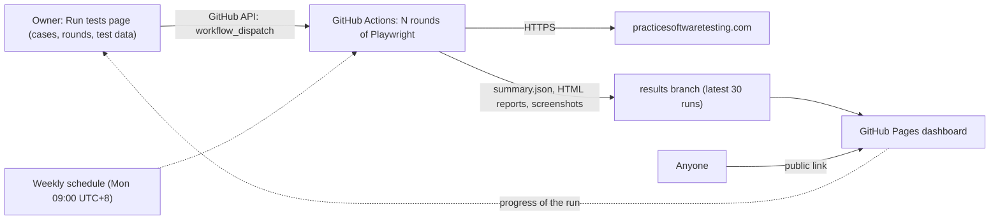

# Playwright E2E Dashboard

[](https://github.com/NTCloudy/playwright-e2e-dashboard/actions/workflows/e2e.yml)

English | [繁體中文](README.zh-TW.md)

End-to-end test automation for a demo e-commerce site, written with **Playwright + TypeScript**.
On the **public, bilingual dashboard** the owner picks the test cases, adjusts their test data and
starts **N rounds** on GitHub Actions; the progress and every result of every round are shown on the
same site.

**Live dashboard: https://ntcloudy.github.io/playwright-e2e-dashboard/**


## Highlights

- **16 test cases**: search, navigation, account, cart, and a full checkout
- **Test console on the dashboard**: tick the cases to run, choose 1–10 rounds, change the test data
  for this run (e.g. the search keyword or the quantity), press **Run** and follow the progress on the
  same page; the request is checked with the same rules CI uses before anything starts
- **Editable titles and descriptions**: each case's title and description (繁體中文 / English) can be
  edited on the dashboard; they live in `config/descriptions.json`, apart from the test code
- **Page Object Model**; selectors only use the site's `data-test` attributes
- **No retries**: running N rounds measures real stability, and flaky cases are flagged
- **Independent tests**: fresh browser context per test, and a fresh account registered through the API for every round
- **Safe checkout**: "Cash on Delivery" only; no card data is ever entered
- **Honest about bot checks**: if the site's Cloudflare bot check challenges the CI runner, the case is
  skipped with the reason and labeled "Blocked"; tests never try to get past it
- **Results website**: history of the latest 30 runs, a test case × round matrix, failure
  screenshots, the test data each run used, and full Playwright HTML reports (steps, video, trace)
- **Bilingual UI** (繁體中文 / English), plain HTML/CSS/JS with zero dependencies

## Test cases

| ID | Module | Case | What it checks |
|---|---|---|---|
| TC01 | Home | Home page loads | Navigation, search, sorting and filters are usable; products with prices are listed |
| TC02 | Home | Return to the home page from a product page | After clicking "Home", the product grid and filters are shown again |
| TC03 | Home | Browse a category | Categories → Hand Tools shows the category title and its products |
| TC04 | Search | Search by keyword | "hammer": the count matches the caption and every name contains the keyword |
| TC05 | Search | Find a specific product | "Claw Hammer" is in the results with a price |
| TC06 | Search | Search with no results | "There are no products found." and an empty grid |
| TC07 | Search | Sort products | "Price (low to high)": the products are listed in that order |
| TC08 | Search | Product details match the search result | Name and price match the list; quantity and "Add to cart" are usable |
| TC09 | Account | Sign in with a valid account | "My account" is shown and the navigation bar shows the user name |
| TC10 | Account | Sign in with an unknown account is rejected | "Invalid email or password"; the user stays signed out |
| TC11 | Cart | Add a product to the cart | Success message; the cart badge shows 1 |
| TC12 | Cart | Increase quantity in the cart | Quantity 3: line total = unit price × 3; cart total and badge are updated |
| TC13 | Cart | Decrease quantity in the cart | Quantity 3 → 1: totals go back to the unit price |
| TC14 | Cart | Remove products from the cart | Removing one of two products recalculates the total; removing the last empties the cart |
| TC15 | Account | Sign out | Signed in through the API; after signing out, "Sign in" is back, the token is cleared and the account page redirects to sign-in |
| TC16 | Checkout | Complete checkout (Cash on Delivery) | Cart → sign in → billing address → payment → order created with an invoice number |

TC10 uses an address that does not exist: repeating wrong passwords for a real account
over many rounds could lock it.

The table shows the default test data (`config/cases.json`); the test console can change it for one
run. The titles and descriptions shown on the dashboard come from `config/descriptions.json` and can
be edited there or on the dashboard. The steps and checks themselves live in the code under `tests/`
and `src/pages/`; each case in the console links to its code on GitHub.

## How it works



1. The dashboard's **Run tests** page starts the workflow through the GitHub API with the `rounds`,
   `cases` and `params` inputs, then follows the run's jobs to show its progress and result.
2. `scripts/run-rounds.mjs` checks the request with `shared/case-params.mjs` (the same rules the console
   uses), then runs `playwright test` N times for the chosen cases; each round writes its own JSON and HTML report.
3. `scripts/aggregate.mjs` merges the rounds into `summary.json` (case × round matrix, pass rates,
   failure screenshots, the test data used) and writes a Markdown summary to the Actions job page.
4. `scripts/publish.mjs` adds the run to the history on the `results` branch and prunes runs beyond 30.
5. `scripts/build-site.mjs` combines `dashboard/` with the history, and the site is deployed to GitHub Pages.
6. A final "Verdict" job fails the workflow when any test failed, so the badge above stays honest.

## Run it

**From the dashboard** (repository owner): open **Run tests**, tick the cases, choose 1–10 rounds,
adjust the test data if needed and press **Run**. The first time, the page asks for a
[fine-grained personal access token](https://github.com/settings/personal-access-tokens/new); the link on
the page pre-fills it, and only the repository has to be picked by hand:

| Setting | Value |
|---|---|
| Repository access | Only select repositories → `playwright-e2e-dashboard` |
| Actions | Read and write (start, follow and cancel runs) |
| Contents | Read and write (only needed to save titles and descriptions) |

The token stays in the browser (until the tab is closed, or on that device if "remember" is ticked)
and is only sent to `api.github.com`. Visitors without a token can see every result but cannot start runs.

**On GitHub**: Actions → **E2E tests** → **Run workflow** works too (rounds, plus optional `cases` and `params`).
A 3-round run of all cases with the default test data starts automatically every Monday at 09:00 Taiwan time.

**Locally** (Node.js 20+):

```bash
npm ci
npx playwright install chromium

npm test                        # one run; HTML report: npm run report
npm run rounds -- 3             # 3 rounds into test-output/run (max 10)
CASES=TC04,TC12 CASE_PARAMS='{"TC04":{"keyword":"pliers"}}' npm run rounds -- 1   # chosen cases and data
npm run aggregate               # -> test-output/run/summary.json

# Preview the dashboard with the local run
npm run site && npm run serve   # then open http://localhost:8080
```

## Project structure

```text
├── .github/workflows/e2e.yml   # CI: N rounds of the chosen cases, publish, deploy, verdict
├── playwright.config.ts        # one worker, no retries, artifacts on failure
├── config/
│   ├── cases.json              # test data per case: defaults, limits, rules
│   └── descriptions.json       # titles and descriptions (zh-TW / EN), editable on the dashboard
├── tests/                      # 16 test cases, one file per module
├── src/
│   ├── pages/                  # Page Objects (Home, Product, Cart, Checkout, Auth, NavBar)
│   ├── api/toolshopApi.ts      # registers a fresh test account per round
│   ├── fixtures.ts             # injects page objects, the test account and the test data
│   └── support/                # test data, bot-check handling, API sign-in, price/toast/sort helpers
├── shared/                     # checks shared by CI and the dashboard (test data, descriptions)
├── scripts/                    # run-rounds, aggregate, publish, build-site, serve
└── dashboard/                  # static results website and test console (zh-TW / EN)
```

## Notes

- The target is [Practice Software Testing](https://practicesoftwaretesting.com), a public demo
  site built for practicing test automation. Tests run one at a time to be gentle on it.
- The site is behind Cloudflare. On GitHub-hosted runners (cloud IP addresses), the first page load of
  each test goes through, but a later full page load in the same session can get a "Performing security
  verification" challenge instead. That affects the two cases where the app itself reloads the page:
  TC09 (the app loads `/account` after signing in) and TC15 (the app reloads after signing out).
  Tests never try to get past the challenge: the case is skipped with the reason and shown as **Blocked**
  on the dashboard. From a regular network all 16 cases run normally (`npm test`).
- The dashboard has no server of its own: starting runs and saving descriptions are GitHub API calls made
  from the owner's browser with the owner's token. Saving a description is a commit to
  `config/descriptions.json`; it never changes the test code.
- GitHub pauses scheduled workflows in public repositories after 60 days without activity;
  re-enable it from the Actions tab.
- Forking: enable GitHub Pages with "GitHub Actions" as the source, then run the workflow once.
  The `results` branch is created automatically. Change `REPO` in `dashboard/core.js` to your repository.

## License

[MIT](LICENSE)
