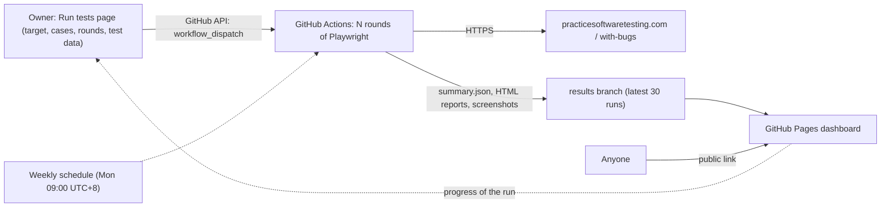

# Playwright E2E Dashboard

[](https://github.com/NTCloudy/playwright-e2e-dashboard/actions/workflows/e2e.yml)
[](https://github.com/NTCloudy/playwright-e2e-dashboard/actions/workflows/ci.yml)

English | [繁體中文](README.zh-TW.md)

End-to-end test automation for the [Practice Software Testing](https://practicesoftwaretesting.com) demo e-commerce store, written with **Playwright + TypeScript**.
On the **public, bilingual dashboard** the owner chooses the target site (`production` or `with-bugs`), picks the test cases, adjusts their test data and starts **N rounds** on GitHub Actions; the progress and every result of every round are shown on the same site.

**Live dashboard: https://ntcloudy.github.io/playwright-e2e-dashboard/**

> **QA Automation Portfolio Series**:
> - 🛒 **Project #1 (This Repo — E-Commerce Web Store E2E & 94-Bug Audit)**: [`NTCloudy/playwright-e2e-dashboard`](https://github.com/NTCloudy/playwright-e2e-dashboard) · [Live E-Commerce QA Dashboard](https://ntcloudy.github.io/playwright-e2e-dashboard/)
> - 🎰 **Project #2 (iGaming / Baccarat Casino Table, Seamless Wallet Concurrency & 100k-Round RTP)**: [`NTCloudy/baccarat-e2e-dashboard`](https://github.com/NTCloudy/baccarat-e2e-dashboard) · [Live Casino QA Dashboard](https://ntcloudy.github.io/baccarat-e2e-dashboard/) · [Live Playable Table](https://ntcloudy.github.io/baccarat-e2e-dashboard/table/)


## Highlights

- **20 test cases across 6 modules**: navigation & images, search & price-range filtering, account, cart & quantity limits, checkout, and contact form attachments
- **Two target releases + Bug detection report (`#/bugs`)**: runs the same suite against both the production store (`practicesoftwaretesting.com`) and the official bug-injected release (`with-bugs.practicesoftwaretesting.com`, 94 seeded bugs); every failure on `with-bugs` is automatically classified against `config/known-bugs.json` (**17 official bugs caught + 1 unlisted finding**, linked to GitHub Issues [#1–#10](https://github.com/NTCloudy/playwright-e2e-dashboard/issues) and evidence screenshots)
- **Test console on the dashboard**: choose the target site, tick the cases to run, choose 1–10 rounds, change the test data for this run (e.g. the search keyword or the quantity), press **Run** and follow the progress on the same page; the request is checked with the same rules CI uses before anything starts
- **Editable titles and descriptions**: each case's title and description (繁體中文 / English) can be edited on the dashboard; they live in `config/descriptions.json`, apart from the test code
- **Page Object Model & soft assertions**: selectors use the site's `data-test` attributes; multi-check cases (`TC17`–`TC20`) use tagged `expect.soft()` checks so a single round reports every bug on the page instead of stopping at the first failure
- **No retries**: running N rounds measures real stability, and flaky cases are flagged
- **Independent tests**: fresh browser context per test, and a fresh account registered through the API for every round
- **Safe checkout**: "Cash on Delivery" only; no card data is ever entered
- **Honest about bot checks**: if the site's Cloudflare bot check challenges the CI runner, the case is skipped with the reason and labeled "Blocked"; tests never try to get past it
- **Tested dashboard & strict CI**: 52 Playwright E2E tests (`dashboard-tests/`) exercise the dashboard UI against a stateful `api.github.com` mock and deterministic fake clock; every push and pull request runs `typecheck`, type-aware `eslint` (including `eslint-plugin-playwright`), `check:config` and `test:dashboard`

## Test cases

| ID | Module | Case | What it checks |
|---|---|---|---|
| TC01 | Home | Home page loads | Navigation, search, sorting and filters are usable; products with prices are listed |
| TC02 | Home | Return to the home page from a product page | After clicking "Home", the product grid and filters are shown again (catches `#29`) |
| TC03 | Home | Browse a category | Categories → Hand Tools shows the category title and its products |
| TC04 | Search | Search by keyword | "hammer": the count matches the caption and every name contains the keyword |
| TC05 | Search | Find a specific product | "Claw Hammer" is in the results with a price |
| TC06 | Search | Search with no results | "There are no products found." and an empty grid (catches unlisted `search-no-results-message`) |
| TC07 | Search | Sort products | "Price (low to high)": the products are listed in that order (catches `#2`) |
| TC08 | Search | Product details match the search result | Name and price match the list; quantity and "Add to cart" are usable |
| TC09 | Account | Sign in with a valid account | "My account" is shown and the navigation bar shows the user name (catches `#32`) |
| TC10 | Account | Sign in with an unknown account is rejected | "Invalid email or password"; the user stays signed out |
| TC11 | Cart | Add a product to the cart | Success message; the cart badge shows 1 (catches `#43`) |
| TC12 | Cart | Increase quantity in the cart | Quantity 3: line total = unit price × 3; cart total and badge are updated |
| TC13 | Cart | Decrease quantity in the cart | Quantity 3 → 1: totals go back to the unit price (catches `#40`) |
| TC14 | Cart | Remove products from the cart | Removing one of two products recalculates the total; removing the last empties the cart |
| TC15 | Account | Sign out | Signed in through the API; after signing out, "Sign in" is back, the token is cleared and the account page redirects to sign-in (catches `#32`) |
| TC16 | Checkout | Complete checkout (Cash on Delivery) | Cart → sign in → billing address → payment → order created with an invoice number |
| TC17 | Home | Page text and images load intact | Logo, search icon, product card images (`naturalWidth > 0`) and navigation/sidebar/product headings (`Contact`, `Sort`, `Search`, `Related products`; catches `#26, #28, #30, #31, #33, #34, #42`) |
| TC18 | Cart | Cart item quantity limit (1–99) | Cart accepts 11 and 99 units (`line total = unit price × quantity`) and rejects 100 (catches `#47`) |
| TC19 | Contact | Contact form attachment (US6100, `with-bugs` only) | Checks US6100: `.txt`/`.pdf`/`.jpg` accepted (`> 0 KB`, `≤ 500 KB`), `0 KB` and `> 500 KB` rejected, file input `accept` filter set (catches `#68, #69, #70`) |
| TC20 | Search | Filter products by price range | Adjusting the maximum price slider filters the grid so every listed product is within `0–maxPrice` (catches `#27`) |

Notes on specific cases:
- **TC10** uses an address that does not exist: repeating wrong passwords for a real account over many rounds could lock it.
- **TC19** is configured with `"targets": ["with-bugs"]` in `config/cases.json`: the production store intentionally implements a stricter `0 KB .txt`-only rule instead of US6100, so `TC19` runs against `with-bugs` to verify US6100 (`#68`, `#69`, `#70`). While testing production we also found an unlisted bug where uploading a non-empty non-`.txt` file overwrites the file-type error with `"File should be empty."` ([Issue #10](https://github.com/NTCloudy/playwright-e2e-dashboard/issues/10)).

## Bug detection (`#/bugs`)

Running the suite against `with-bugs.practicesoftwaretesting.com` (`TARGET=with-bugs`) tests the tests themselves. `shared/bug-detection.mjs` (used both by the dashboard and by `scripts/verdict.mjs` in CI) matches every failure message against `config/known-bugs.json`:

- **17 in-scope official bugs caught** across `TC02`, `TC07`, `TC09`, `TC11`, `TC13`, `TC15`, `TC17`, `TC18`, `TC19`, and `TC20`
- **1 unlisted finding caught** on `with-bugs` (`TC06` `search-no-results-message`, [Issue #9](https://github.com/NTCloudy/playwright-e2e-dashboard/issues/9)) + **1 unlisted finding documented on `production`** ([Issue #10](https://github.com/NTCloudy/playwright-e2e-dashboard/issues/10))
- **Precondition blocking**: when `#43` fails in `addToCart()`, downstream cart/checkout cases (`TC12`, `TC14`, `TC16`) are classified as **Blocked by `#43`** rather than unrelated failures
- **CI Verdict (`scripts/verdict.mjs`)**:
  - On `production`: exits `0` only when every executed case passes and no round broke.
  - On `with-bugs`: exits `0` when every failure is explained by `config/known-bugs.json` and no in-scope known bug was missed (fails if an unknown failure appears or a known bug goes undetected).

## How it works



1. The dashboard's **Run tests** page starts the workflow through the GitHub API with the `target`, `rounds`, `cases` and `params` inputs, then follows the run's jobs to show its progress and result.
2. `scripts/run-rounds.mjs` checks the request with `shared/case-params.mjs` (the same rules the console uses), then runs `playwright test` N times for the chosen cases and target; each round writes its own JSON and HTML report.
3. `scripts/aggregate.mjs` merges the rounds into `summary.json` (case × round matrix, pass rates, failure screenshots, all soft-assertion failure messages, the test data used) and writes a Markdown summary to the Actions job page.
4. `scripts/publish.mjs` adds the run to the history on the `results` branch and prunes old runs while always preserving the latest full run of each target (`production` and `with-bugs`).
5. `scripts/build-site.mjs` combines `dashboard/` with the history and `config/known-bugs.json`, and deploys the site to GitHub Pages.
6. A final **Verdict** job runs `scripts/verdict.mjs` to verify the run outcome.

## Run it

**From the dashboard** (repository owner): open **Run tests**, choose the target site (`production` or `with-bugs`), tick the cases, choose 1–10 rounds, adjust the test data if needed and press **Run**. The first time, the page asks for a [fine-grained personal access token](https://github.com/settings/personal-access-tokens/new); the link on the page pre-fills it, and only the repository has to be picked by hand:

| Setting | Value |
|---|---|
| Repository access | Only select repositories → `playwright-e2e-dashboard` |
| Actions | Read and write (start, follow and cancel runs) |
| Contents | Read and write (only needed to save titles and descriptions) |

The token stays in the browser (until the tab is closed, or on that device if "remember" is ticked) and is only sent to `api.github.com`. Visitors without a token can see every result and the Bug detection report, but cannot start runs.

**On GitHub**: Actions → **E2E tests** → **Run workflow** works too (`target`, `rounds`, plus optional `cases` and `params`). A 3-round run of all applicable cases on `production` starts automatically every Monday at 09:00 Taiwan time.

**Locally** (Node.js 20+):

```bash
npm ci
npx playwright install chromium

# Static checks and dashboard UI tests
npm run typecheck
npm run lint
npm run check:config
npm run test:dashboard

# Run E2E tests against the live demo store (production or with-bugs)
npm test                                    # one round on production
TARGET=with-bugs npm test                   # one round on with-bugs
npm run rounds -- 3                         # 3 rounds into test-output/run (max 10)
CASES=TC04,TC12 CASE_PARAMS='{"TC04":{"keyword":"pliers"}}' npm run rounds -- 1
npm run aggregate                           # -> test-output/run/summary.json
npm run verdict                             # checks summary.json against the target rules

# Preview the dashboard locally
npm run site && npm run serve               # then open http://localhost:8080
```

## Project structure

```text
├── .github/workflows/
│   ├── ci.yml                  # push/PR checks: typecheck, eslint, check:config, dashboard E2E tests
│   └── e2e.yml                 # N rounds against production or with-bugs, publish, deploy, verdict
├── playwright.config.ts        # E2E config (one worker, no retries, artifacts on failure)
├── playwright.dashboard.config.ts # config for testing the dashboard UI itself
├── eslint.config.mjs           # flat ESLint config (type-checked TypeScript + Playwright rules)
├── config/
│   ├── cases.json              # test data per case: defaults, limits, rules, optional targets
│   ├── descriptions.json       # titles and descriptions (zh-TW / EN), editable on the dashboard
│   └── known-bugs.json         # 17 targeted official bugs, 1 unlisted finding, 5 out-of-scope groups
├── tests/                      # 20 E2E test cases across 6 spec files
├── dashboard-tests/            # 52 Playwright tests for the dashboard UI & mocked GitHub API
├── src/
│   ├── pages/                  # Page Objects (Home, Product, Cart, Checkout, Auth, Contact, NavBar)
│   ├── api/toolshopApi.ts      # registers a fresh test account per round
│   ├── fixtures.ts             # injects page objects, the test account and the test data
│   └── support/                # test data, bot-check handling, API sign-in, price/toast/sort helpers
├── shared/                     # modules shared by CI scripts and the browser (targets, bug-detection, params, descriptions)
├── scripts/                    # run-rounds, aggregate, verdict, publish, build-site, check-config, serve
├── docs/bugs/                  # failure evidence screenshots linked from #/bugs and GitHub Issues
└── dashboard/                  # static results website, Bug detection page and test console (zh-TW / EN)
```

## Notes

- The target is [Practice Software Testing](https://practicesoftwaretesting.com), a public demo site built for practicing test automation. Tests run one at a time to be gentle on it.
- The site is behind Cloudflare. On GitHub-hosted runners (cloud IP addresses), the first page load of each test goes through, but a later full page load in the same session can get a "Performing security verification" challenge instead. That affects the two cases where the app itself reloads the page: TC09 (the app loads `/account` after signing in) and TC15 (the app reloads after signing out). Tests never try to get past the challenge: the case is skipped with the reason and shown as **Blocked** on the dashboard. From a regular network all 20 cases run normally (`npm test`).
- The dashboard has no server of its own: starting runs and saving descriptions are GitHub API calls made from the owner's browser with the owner's token. Saving a description is a commit to `config/descriptions.json`; it never changes the test code.
- GitHub pauses scheduled workflows in public repositories after 60 days without activity; re-enable it from the Actions tab.
- Forking: enable GitHub Pages with "GitHub Actions" as the source, then run the workflow once. The `results` branch is created automatically. Change `REPO` in `dashboard/core.js` to your repository.

## License

[MIT](LICENSE)
