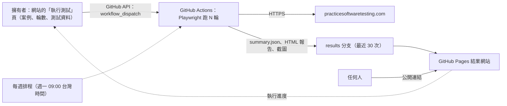

# Playwright E2E 自動化測試儀表板

[](https://github.com/NTCloudy/playwright-e2e-dashboard/actions/workflows/e2e.yml)

[English](README.md) | 繁體中文

用 **Playwright + TypeScript** 對示範電商網站做端對端（E2E）自動化測試。
在**公開的雙語結果網站**上，擁有者可以選擇這次要跑哪些測試案例、調整測試資料、**跑 N 輪**；
測試在 GitHub Actions 上執行，進度和每一輪、每條案例的結果都直接顯示在同一個網站。

**結果網站：https://ntcloudy.github.io/playwright-e2e-dashboard/**


## 特色

- **16 條測試案例**：搜尋、頁面導覽、會員、購物車、完整結帳
- **網站上的測試控制台**：勾選要跑的案例、選 1～10 輪、調整這次的測試資料（例如搜尋關鍵字、數量），
  按「執行」後進度就顯示在同一頁；送出前會用和 CI 相同的規則檢查
- **可以編輯的名稱與描述**：每條案例的名稱與描述（中文／英文）都能在網站上修改，存在
  `config/descriptions.json`，和測試程式碼分開
- **Page Object 架構**；元素定位只用網站提供的 `data-test` 屬性
- **失敗不重試**：跑 N 輪就是要看真實的穩定度，時好時壞的案例會標示「不穩定」
- **案例彼此獨立**：每條案例都用全新的瀏覽器環境；每一輪都透過 API 註冊全新的測試帳號
- **安全的結帳測試**：只用「貨到付款」，不會輸入任何信用卡資料
- **誠實面對機器人驗證**：如果網站的 Cloudflare 機器人驗證擋下 CI 主機，該案例會記為略過、附上原因並標示
  「被擋下」；測試不會嘗試繞過驗證
- **結果網站**：保留最近 30 次執行紀錄、「測試案例 × 輪次」矩陣、失敗截圖、每次用的測試資料，
  以及完整的 Playwright HTML 報告（步驟、影片、trace）
- **中英雙語介面**，純 HTML/CSS/JS，沒有任何套件相依

## 測試案例

| 編號 | 模組 | 案例 | 驗證內容 |
|---|---|---|---|
| TC01 | 首頁 | 首頁正常載入 | 導覽列、搜尋、排序、篩選都可以用；商品列表有名稱和價格 |
| TC02 | 首頁 | 從商品頁返回首頁 | 點導覽列「Home」後，商品列表與篩選區重新出現 |
| TC03 | 首頁 | 瀏覽分類頁 | Categories → Hand Tools 顯示分類標題與商品 |
| TC04 | 搜尋 | 關鍵字搜尋 | 搜尋「hammer」：筆數與網站顯示一致，每筆名稱都含關鍵字 |
| TC05 | 搜尋 | 指定商品可以找到 | 「Claw Hammer」出現在結果中，而且有價格 |
| TC06 | 搜尋 | 搜尋查無結果 | 顯示「There are no products found.」，列表為空 |
| TC07 | 搜尋 | 商品排序 | 「價格低→高」：商品依照這個順序排列 |
| TC08 | 搜尋 | 商品詳情與搜尋結果一致 | 名稱、價格與列表一致；數量與加入購物車可以用 |
| TC09 | 會員 | 登入成功 | 進入 My account，導覽列顯示使用者名稱 |
| TC10 | 會員 | 不存在的帳號無法登入 | 顯示「Invalid email or password」，維持未登入 |
| TC11 | 購物車 | 加入購物車 | 出現成功提示，購物車圖示數量為 1 |
| TC12 | 購物車 | 購物車增加數量 | 數量改成 3：小計 = 單價 × 3，總計與圖示同步更新 |
| TC13 | 購物車 | 購物車減少數量 | 數量 3 → 1：小計、總計回到單價 |
| TC14 | 購物車 | 從購物車刪除商品 | 兩項商品刪除一項 → 總計重算；刪除最後一項 → 購物車清空 |
| TC15 | 會員 | 登出 | 先透過 API 登入；登出後「Sign in」重新出現、token 已清除，也無法再進入帳戶頁 |
| TC16 | 結帳 | 完整結帳（貨到付款） | 購物車 → 登入 → 帳單地址 → 付款 → 訂單建立成功並顯示訂單編號 |

TC10 刻意使用不存在的帳號：如果用真實帳號輸錯密碼，跑很多輪可能會把帳號鎖住。

表格裡是預設的測試資料（`config/cases.json`），測試控制台可以只針對某一次執行修改。網站上顯示的案例名稱與描述
存在 `config/descriptions.json`，可以直接改檔案或在網站上編輯；測試步驟和檢查寫在 `tests/` 和 `src/pages/` 的
程式碼裡，控制台的每條案例都有連到 GitHub 上對應程式碼的連結。

## 運作方式



1. 網站的「執行測試」頁透過 GitHub API 啟動 workflow（輸入 `rounds`、`cases`、`params`），
   接著追蹤各個 job 的狀態，把進度和結果顯示在頁面上。
2. `scripts/run-rounds.mjs` 先用 `shared/case-params.mjs`（和控制台相同的規則）檢查這次的請求，
   再對選到的案例執行 N 次 `playwright test`，每一輪各自產生 JSON 和 HTML 報告。
3. `scripts/aggregate.mjs` 把各輪結果整合成 `summary.json`（案例 × 輪次矩陣、通過率、失敗截圖、用了哪些測試資料），
   並在 Actions 頁面寫出 Markdown 摘要。
4. `scripts/publish.mjs` 把這次執行加進 `results` 分支的歷史紀錄，超過 30 次的舊紀錄會被刪除。
5. `scripts/build-site.mjs` 把 `dashboard/` 和歷史紀錄組成網站，部署到 GitHub Pages。
6. 最後的「Verdict」job 在有任何案例失敗時讓 workflow 顯示失敗，上方徽章才會如實反映結果。

## 執行方式

**在結果網站上**（限 repo 擁有者）：打開「執行測試」，勾選案例、選 1～10 輪，需要的話調整測試資料，按「執行」。
第一次使用時，頁面會請你設定一個
[fine-grained personal access token](https://github.com/settings/personal-access-tokens/new)；
頁面上的連結會幫你把設定填好，只有 repository 要自己選：

| 設定 | 值 |
|---|---|
| Repository access | Only select repositories → `playwright-e2e-dashboard` |
| Actions | Read and write（開始、追蹤、取消測試執行） |
| Contents | Read and write（只有儲存名稱與描述時需要） |

token 只存在瀏覽器裡（關閉分頁就清除；勾選「記住」才會留在那台裝置），而且只會傳給 `api.github.com`。
沒有 token 的訪客可以看所有結果，但不能執行測試。

**在 GitHub 上**：Actions → **E2E tests** → **Run workflow** 也可以（輪數，以及選填的 `cases`、`params`）。
另外每週一 09:00（台灣時間）會自動用預設的測試資料把全部案例跑 3 輪。

**在本機**（Node.js 20 以上）：

```bash
npm ci
npx playwright install chromium

npm test                        # 跑一次；HTML 報告：npm run report
npm run rounds -- 3             # 跑 3 輪（最多 10 輪），結果在 test-output/run
CASES=TC04,TC12 CASE_PARAMS='{"TC04":{"keyword":"pliers"}}' npm run rounds -- 1   # 指定案例與測試資料
npm run aggregate               # 產生 test-output/run/summary.json

# 用本機結果預覽結果網站
npm run site && npm run serve   # 打開 http://localhost:8080
```

## 專案結構

```text
├── .github/workflows/e2e.yml   # CI：把選到的案例跑 N 輪、發布結果、部署、判定
├── playwright.config.ts        # 單一 worker、不重試、失敗時保留截圖／影片／trace
├── config/
│   ├── cases.json              # 每條案例的測試資料：預設值、限制、規則
│   └── descriptions.json       # 案例名稱與描述（中文／英文），可以在網站上編輯
├── tests/                      # 16 條測試案例，每個模組一個檔案
├── src/
│   ├── pages/                  # Page Objects（首頁、商品、購物車、結帳、登入、導覽列）
│   ├── api/toolshopApi.ts      # 每一輪註冊全新的測試帳號
│   ├── fixtures.ts             # 注入 Page Objects、測試帳號與測試資料
│   └── support/                # 測試資料、機器人驗證處理、API 登入、價格／提示訊息／排序等工具
├── shared/                     # CI 和網站共用的檢查（測試資料、名稱與描述）
├── scripts/                    # run-rounds、aggregate、publish、build-site、serve
└── dashboard/                  # 靜態結果網站與測試控制台（中文／英文）
```

## 注意事項

- 測試目標是 [Practice Software Testing](https://practicesoftwaretesting.com)，專門給自動化測試
  練習的公開示範網站。測試一次只跑一條，避免對網站造成負擔。
- 這個網站有 Cloudflare 保護。從 GitHub 提供的 CI 主機（雲端 IP）執行時，每條測試的第一次頁面載入可以通過，
  但同一個瀏覽器工作階段裡的下一次整頁載入，可能會被換成「Performing security verification」驗證頁。
  受影響的是網站自己會重新載入頁面的兩條案例：TC09（登入後網站會載入 `/account`）和 TC15（登出後網站會重新整理）。
  測試不會嘗試繞過驗證：該案例會記為略過並附上原因，在儀表板上標示「被擋下」。
  在一般網路環境執行（`npm test`），16 條都可以正常跑完。
- 結果網站沒有自己的伺服器：執行測試和儲存描述都是擁有者的瀏覽器用擁有者的 token 呼叫 GitHub API。
  儲存描述就是對 `config/descriptions.json` 做一個 commit，不會改到測試程式碼。
- 公開 repo 如果 60 天沒有任何活動，GitHub 會暫停排程；到 Actions 頁面重新啟用即可。
- Fork 使用：在 Settings → Pages 把來源設為「GitHub Actions」，再執行一次 workflow 即可，
  `results` 分支會自動建立。記得把 `dashboard/core.js` 裡的 `REPO` 改成你的 repo。

## 授權

[MIT](LICENSE)
