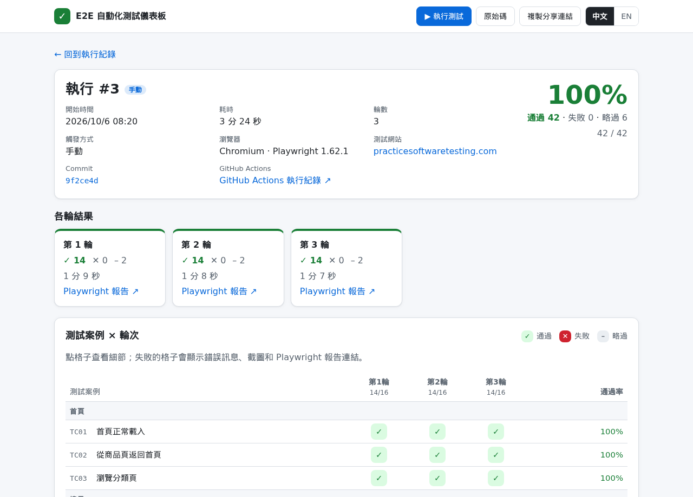
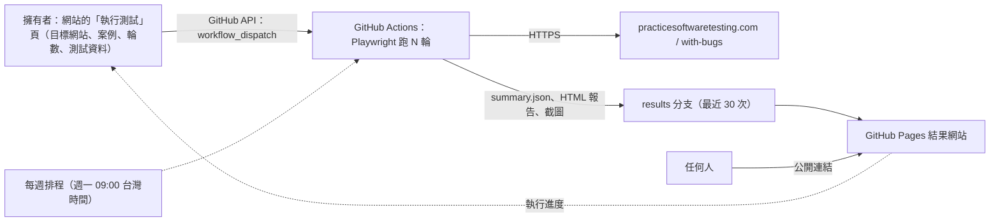

# Playwright E2E 自動化測試儀表板

[](https://github.com/NTCloudy/playwright-e2e-dashboard/actions/workflows/e2e.yml)
[](https://github.com/NTCloudy/playwright-e2e-dashboard/actions/workflows/ci.yml)

[English](README.md) | 繁體中文

用 **Playwright + TypeScript** 對 [Practice Software Testing](https://practicesoftwaretesting.com) 示範電商網站做端對端（E2E）自動化測試。
在**公開的雙語結果網站**上，擁有者可以選擇測試目標網站（`production` 正式版或 `with-bugs` 植入 Bug 版）、勾選這次要跑哪些測試案例、調整測試資料、**跑 N 輪**；測試在 GitHub Actions 上執行，進度和每一輪、每條案例的結果都直接顯示在同一個網站。

**結果網站：https://ntcloudy.github.io/playwright-e2e-dashboard/**



## 特色

- **6 大模組、20 條測試案例**：首頁導覽與圖片文字檢查、搜尋與價格區間篩選、會員、購物車與數量上限、完整結帳、聯絡表單附件驗證
- **雙目標網站與 Bug 偵測報告（`#/bugs`）**：同一套測試可對正式版（`practicesoftwaretesting.com`）與官方預先埋入 94 個問題的 `with-bugs` 版本（`with-bugs.practicesoftwaretesting.com`）執行；所有 `with-bugs` 的失敗都會自動比對 `config/known-bugs.json`（**抓到 17 個官方 Bug + 1 個額外問題**，並連結到 GitHub Issues [#1–#10](https://github.com/NTCloudy/playwright-e2e-dashboard/issues) 與證據截圖）
- **網站上的測試控制台**：選擇目標網站、勾選要跑的案例、選 1～10 輪、調整這次的測試資料（例如搜尋關鍵字、數量、價格上限），按「執行」後進度就顯示在同一頁；送出前會用和 CI 相同的規則檢查
- **可以編輯的名稱與描述**：每條案例的名稱與描述（中文／英文）都能在網站上修改，存在 `config/descriptions.json`，和測試程式碼分開
- **Page Object 架構與軟斷言（Soft Assertions）**：元素定位優先使用 `data-test` 屬性；多檢查點案例（`TC17`～`TC20`）使用帶標籤的 `expect.soft()`，一輪執行就能抓出頁面上所有問題，不會在第一個錯誤就停下
- **失敗不重試**：跑 N 輪就是要看真實的穩定度，時好時壞的案例會標示「不穩定」
- **案例彼此獨立**：每條案例都用全新的瀏覽器環境；每一輪都透過 API 註冊全新的測試帳號
- **安全的結帳測試**：只用「貨到付款」，不會輸入任何信用卡資料
- **誠實面對機器人驗證**：如果網站的 Cloudflare 機器人驗證擋下 CI 主機，該案例會記為略過、附上原因並標示「被擋下」；測試不會嘗試繞過驗證
- **儀表板自測與嚴格 CI 檢查**：內建 52 條針對儀表板本身的 Playwright 測試（`dashboard-tests/`，搭配完整的 `api.github.com` 模擬與虛擬時鐘）；每次 push 與 PR 都會自動執行 `typecheck`、含型別資訊的 `eslint`（含 `eslint-plugin-playwright`）、`check:config` 與 `test:dashboard`

## 測試案例

| 編號 | 模組 | 案例 | 驗證內容 |
|---|---|---|---|
| TC01 | 首頁 | 首頁正常載入 | 導覽列、搜尋、排序、篩選都可以用；商品列表有名稱和價格 |
| TC02 | 首頁 | 從商品頁返回首頁 | 點導覽列「Home」後，商品列表與篩選區重新出現（可抓到 `#29`） |
| TC03 | 首頁 | 瀏覽分類頁 | Categories → Hand Tools 顯示分類標題與商品 |
| TC04 | 搜尋 | 關鍵字搜尋 | 搜尋「hammer」：筆數與網站顯示一致，每筆名稱都含關鍵字 |
| TC05 | 搜尋 | 指定商品可以找到 | 「Claw Hammer」出現在結果中，而且有價格 |
| TC06 | 搜尋 | 搜尋查無結果 | 顯示「There are no products found.」，列表為空（可抓到額外問題 `search-no-results-message`） |
| TC07 | 搜尋 | 商品排序 | 「價格低→高」：商品依照這個順序排列（可抓到 `#2`） |
| TC08 | 搜尋 | 商品詳情與搜尋結果一致 | 名稱、價格與列表一致；數量與加入購物車可以用 |
| TC09 | 會員 | 登入成功 | 進入 My account，導覽列顯示使用者名稱（可抓到 `#32`） |
| TC10 | 會員 | 不存在的帳號無法登入 | 顯示「Invalid email or password」，維持未登入 |
| TC11 | 購物車 | 加入購物車 | 出現成功提示，購物車圖示數量為 1（可抓到 `#43`） |
| TC12 | 購物車 | 購物車增加數量 | 數量改成 3：小計 = 單價 × 3，總計與圖示同步更新 |
| TC13 | 購物車 | 購物車減少數量 | 數量 3 → 1：小計、總計回到單價（可抓到 `#40`） |
| TC14 | 購物車 | 從購物車刪除商品 | 兩項商品刪除一項 → 總計重算；刪除最後一項 → 購物車清空 |
| TC15 | 會員 | 登出 | 先透過 API 登入；登出後「Sign in」重新出現、token 已清除，也無法再進入帳戶頁（可抓到 `#32`） |
| TC16 | 結帳 | 完整結帳（貨到付款） | 購物車 → 登入 → 帳單地址 → 付款 → 訂單建立成功並顯示訂單編號 |
| TC17 | 首頁 | 頁面文字與圖片完整性檢查 | 檢查頁首標誌、搜尋圖示、首頁商品圖片（`naturalWidth > 0`），以及導覽列、側邊欄與商品頁標題拼字（可抓到 `#26, #28, #30, #31, #33, #34, #42`） |
| TC18 | 購物車 | 購物車商品數量上限（1～99） | 驗證購物車可設定 11 與 99 個（小計 = 單價 × 數量），且拒絕 100 個（可抓到 `#47`） |
| TC19 | 聯絡我們 | 聯絡表單附件驗證（US6100，僅 `with-bugs`） | 依 US6100 驗證接受大於 0 KB 且不超過 500 KB 的 `.txt`、`.pdf`、`.jpg` 檔案，拒絕 0 KB 與超過 500 KB 的檔案，並檢查 `accept` 屬性（可抓到 `#68, #69, #70`） |
| TC20 | 搜尋 | 價格區間滑桿篩選商品 | 將價格上限滑桿調到指定金額後，檢查列表每筆商品價格都在 `0～上限` 範圍內（可抓到 `#27`） |

補充說明：
- **TC10** 刻意使用不存在的帳號：如果用真實帳號輸錯密碼，跑很多輪可能會把帳號鎖住。
- **TC19** 在 `config/cases.json` 設定為 `"targets": ["with-bugs"]`：因為正式版網站採用了「只接受 0 KB 的 `.txt` 檔」的另一套規則，並非 US6100 規格，所以 `TC19` 專門對 `with-bugs` 執行以驗證 US6100 的 `#68`、`#69`、`#70`。此外，我們在測試正式版聯絡表單時也額外發現一個前端驗證訊息覆蓋的 Bug：上傳非空白且非 `.txt` 的檔案時，型別錯誤會被後面的檢查覆蓋成 `"File should be empty."`（已紀錄於 [Issue #10](https://github.com/NTCloudy/playwright-e2e-dashboard/issues/10)）。

## Bug 偵測報告（`#/bugs`）

把同一套測試拿去跑 `with-bugs.practicesoftwaretesting.com`（`TARGET=with-bugs`），可以用來驗證「測試本身抓不抓得到問題」。`shared/bug-detection.mjs`（由儀表板頁面與 CI 的 `scripts/verdict.mjs` 共用）會把每個失敗訊息自動比對 `config/known-bugs.json`：

- **抓到 17 個涵蓋範圍內的官方 Bug**（分布於 `TC02`、`TC07`、`TC09`、`TC11`、`TC13`、`TC15`、`TC17`、`TC18`、`TC19`、`TC20`）
- **抓到 1 個 `with-bugs` 上的非官方清單問題**（`TC06` 查無結果未顯示提示，[Issue #9](https://github.com/NTCloudy/playwright-e2e-dashboard/issues/9)）＋ **紀錄 1 個正式版上的非官方清單問題**（[Issue #10](https://github.com/NTCloudy/playwright-e2e-dashboard/issues/10)）
- **前置問題阻擋歸類**：當 `#43`（加入購物車跳出錯誤）發生時，後面需要先加商品進購物車的 `TC12`、`TC14`、`TC16` 會自動歸類為「**被 `#43` 阻擋**」，不會誤判成不明原因失敗
- **CI 判定規則（`scripts/verdict.mjs`）**：
  - `production`：所有執行的案例都通過、且沒有任何一輪中斷才算通過（綠燈）。
  - `with-bugs`：所有失敗都能被 `config/known-bugs.json` 解釋、且涵蓋範圍內的已知問題一個都沒漏抓才算通過（綠燈）；如果有未知失敗或漏抓已知 Bug 則會失敗（紅燈）。

## 運作方式



1. 網站的「執行測試」頁透過 GitHub API 啟動 workflow（輸入 `target`、`rounds`、`cases`、`params`），接著追蹤各個 job 的狀態，把進度和結果顯示在頁面上。
2. `scripts/run-rounds.mjs` 先用 `shared/case-params.mjs`（和控制台相同的規則）檢查這次的請求，再對選到的目標網站與案例執行 N 次 `playwright test`，每一輪各自產生 JSON 和 HTML 報告。
3. `scripts/aggregate.mjs` 把各輪結果整合成 `summary.json`（案例 × 輪次矩陣、通過率、失敗截圖、軟斷言的所有錯誤訊息、用了哪些測試資料），並在 Actions 頁面寫出 Markdown 摘要。
4. `scripts/publish.mjs` 把這次執行加進 `results` 分支的歷史紀錄，清理超過 30 次的舊紀錄時會自動保留每個目標網站（`production` 與 `with-bugs`）最近一次的完整執行。
5. `scripts/build-site.mjs` 把 `dashboard/`、歷史紀錄與 `config/known-bugs.json` 組成網站，部署到 GitHub Pages。
6. 最後的「Verdict」job 執行 `scripts/verdict.mjs`，依據目標網站的判定規則決定 workflow 綠燈或紅燈。

## 執行方式

**在結果網站上**（限 repo 擁有者）：打開「執行測試」，選擇目標網站（`production` 或 `with-bugs`）、勾選案例、選 1～10 輪，需要的話調整測試資料，按「執行」。第一次使用時，頁面會請你設定一個 [fine-grained personal access token](https://github.com/settings/personal-access-tokens/new)；頁面上的連結會幫你把設定填好，只有 repository 要自己選：

| 設定 | 值 |
|---|---|
| Repository access | Only select repositories → `playwright-e2e-dashboard` |
| Actions | Read and write（開始、追蹤、取消測試執行） |
| Contents | Read and write（只有儲存名稱與描述時需要） |

token 只存在瀏覽器裡（關閉分頁就清除；勾選「記住」才會留在那台裝置），而且只會傳給 `api.github.com`。沒有 token 的訪客可以看所有執行結果與 Bug 偵測報告，但不能啟動測試。

**在 GitHub 上**：Actions → **E2E tests** → **Run workflow** 也可以（選擇 `target`、`rounds`，以及選填的 `cases`、`params`）。另外每週一 09:00（台灣時間）會自動用預設的測試資料把正式版全部適用案例跑 3 輪。

**在本機**（Node.js 20 以上）：

```bash
npm ci
npx playwright install chromium

# 型別、Lint、設定檔與儀表板本身的自動化測試
npm run typecheck
npm run lint
npm run check:config
npm run test:dashboard

# 對示範電商網站執行 E2E 測試（production 或 with-bugs）
npm test                                    # 正式版跑 1 輪；HTML 報告：npm run report
TARGET=with-bugs npm test                   # with-bugs 版本跑 1 輪
npm run rounds -- 3                         # 跑 3 輪（最多 10 輪），結果在 test-output/run
CASES=TC04,TC12 CASE_PARAMS='{"TC04":{"keyword":"pliers"}}' npm run rounds -- 1
npm run aggregate                           # 產生 test-output/run/summary.json
npm run verdict                             # 依目標網站規則檢查 summary.json

# 用本機結果預覽結果網站
npm run site && npm run serve               # 打開 http://localhost:8080
```

## 專案結構

```text
├── .github/workflows/
│   ├── ci.yml                  # Push/PR 自動檢查：typecheck、eslint、check:config、儀表板 E2E 測試
│   └── e2e.yml                 # 對 production 或 with-bugs 跑 N 輪、發布結果、部署、判定
├── playwright.config.ts        # 電商網站 E2E 設定（單一 worker、不重試、失敗時保留截圖／影片／trace）
├── playwright.dashboard.config.ts # 儀表板本身的 Playwright 測試設定
├── eslint.config.mjs           # ESLint 設定（含 TypeScript 型別檢查與 Playwright 規則）
├── config/
│   ├── cases.json              # 每條案例的測試資料：預設值、限制、規則、適用目標網站
│   ├── descriptions.json       # 案例名稱與描述（中文／英文），可以在網站上編輯
│   └── known-bugs.json         # 17 個涵蓋的官方 Bug、1 個額外問題、5 類不納入範圍的原因說明
├── tests/                      # 20 條電商網站 E2E 測試案例（6 個模組檔案）
├── dashboard-tests/            # 52 條針對儀表板介面與 GitHub API 互動的 Playwright 測試
├── src/
│   ├── pages/                  # Page Objects（首頁、商品、購物車、結帳、登入、聯絡我們、導覽列）
│   ├── api/toolshopApi.ts      # 每一輪註冊全新的測試帳號
│   ├── fixtures.ts             # 注入 Page Objects、測試帳號與測試資料
│   └── support/                # 測試資料、機器人驗證處理、API 登入、價格／提示訊息／排序等工具
├── shared/                     # CI 與瀏覽器共用的模組（目標網站、Bug 偵測歸類、測試資料與描述檢查）
├── scripts/                    # run-rounds、aggregate、verdict、publish、build-site、check-config、serve
├── docs/bugs/                  # Bug 偵測報告與 GitHub Issues 引用的失敗證據截圖
└── dashboard/                  # 靜態結果網站、Bug 偵測報告與測試控制台（中文／英文）
```

## 注意事項

- 測試目標是 [Practice Software Testing](https://practicesoftwaretesting.com)，專門給自動化測試練習的公開示範網站。測試一次只跑一條，避免對網站造成負擔。
- 這個網站有 Cloudflare 保護。從 GitHub 提供的 CI 主機（雲端 IP）執行時，每條測試的第一次頁面載入可以通過，但同一個瀏覽器工作階段裡的下一次整頁載入，可能會被換成「Performing security verification」驗證頁。受影響的是網站自己會重新載入頁面的兩條案例：TC09（登入後網站會載入 `/account`）和 TC15（登出後網站會重新整理）。測試不會嘗試繞過驗證：該案例會記為略過並附上原因，在儀表板上標示「被擋下」。在一般網路環境執行（`npm test`），20 條都可以正常跑完。
- 結果網站沒有自己的伺服器：執行測試和儲存描述都是擁有者的瀏覽器用擁有者的 token 呼叫 GitHub API。儲存描述就是對 `config/descriptions.json` 做一個 commit，不會改到測試程式碼。
- 公開 repo 如果 60 天沒有任何活動，GitHub 會暫停排程；到 Actions 頁面重新啟用即可。
- Fork 使用：在 Settings → Pages 把來源設為「GitHub Actions」，再執行一次 workflow 即可，`results` 分支會自動建立。記得把 `dashboard/core.js` 裡的 `REPO` 改成你的 repo。

## 授權

[MIT](LICENSE)
